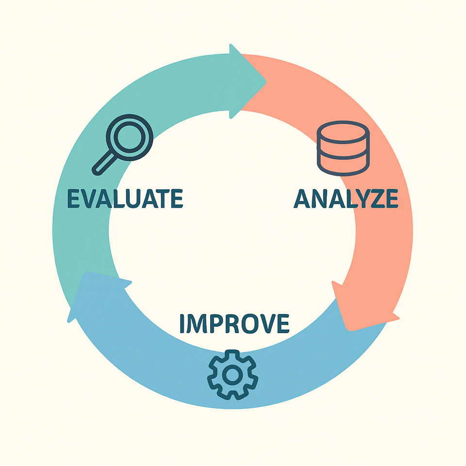

<p align="center">
  
</p>

<h1 align="center">Generative Policy‑Aware Chatbot</h1>

<p align="center">
  <strong>🧘 Keep calm</strong> and <strong>chat</strong> with me 💬<br>
  📦 Your orders deserve order! ✅
</p>

<p align="center">
  <a href="# 🎯 Features">Features</a> •
  <a href="#installation">Installation</a> •
  <a href="#usage">Usage</a> •
  <a href="#license">License</a>
</p>


This project implements a fully generative chatbot using LangChain, integrating it with two API endpoints: `OrderCancellation` and `OrderTracking`. The chatbot adheres to specific company policies using an LLM for decision-making.

	1.	Intent Recognition → 2. Policy Check → 3. Tool Invocation (API call) → 4. Response Generation

# 🎯 Features
- Order tracking and cancellation via mocked API
- Company policy enforcement (return‑window, monthly quota, blackout‑date rules)
- LLM-agent powered decisions using Mistral-7B-Instruct-v0.3 model
- LLM inference with llama.cpp HTTP server
- Sentiment analysis using Transformers
- Step-by-step evaluation using a synthetic dataset and an LLM judge
- Experiment tracking with Weave by W&B

# 🛠 Installation

1. Create a conda environment.

``` bash
conda create -n zenbot python=3.10 -y
conda activate zenbot
```

2. Download ZenBot code and install the requirements for this project.

```bash
git clone https://github.com/curly1/ZenBot.git
cd ZenBot
pip install -r requirements.txt
```

3. Build [llama.cpp](https://github.com/ggml-org/llama.cpp?tab=readme-ov-file#building-the-project) on your system, e.g. on MacOS:

```bash
brew install llama.cpp
```

# 🧠 Technical Choices

**Framework**: LangChain, chosen for its intuitive workflow management, chaining capabilities, and strong integration with LLMs.

**LLM**: GPT-3.5-turbo via OpenAI's free API tier, chosen due to accessibility and strong performance.

**Mock APIs**: Implemented by checking a `ZENBOT_SIMULATE_API` environment variable. When enabled, returning randomized dummy responses for cancellation and tracking calls instead of making real HTTP requests.

**Evaluation**: Weave by Weights & Biases provides powerful, interactive experiment tracking and analysis.

# 🚀 How to Run

- **Baseline**: 
```
python src/baseline_agent.py
```

- **ZenBot**:

Download [Mistral-7B-Instruct-v0.3.Q4_K_M.gguf](https://huggingface.co/MaziyarPanahi/Mistral-7B-Instruct-v0.3-GGUF/blob/main/Mistral-7B-Instruct-v0.3.Q4_K_M.gguf) model.

```
llama-server -m pretrained/gguf_models/Mistral-7B-Instruct-v0.3.Q4_K_M.gguf --port 8080 --jinja
python src/zenbot.py
```

# 📁 Project Structure

### TODO - ADD PROJECT STRUCTURE AND DESCRIBE WHAT IS DONE IN THE FILES

<cite>Please note: `data/`, `logs/` and `evaluation/data/` directories are included in the github repo for visibility.</cite>

# 🧪 Experiment Design & Evaluation

## Objective
Measure how effectively ZenBot:
- Correctly identifies user intent and selects the appropriate tool.
- Enforces business policies for cancellations, returns and blackout periods.
- Generates accurate, coherent responses via the LLM.

## Baseline

We also provide a simple rule-based agent which serves as a baseline for the experiments. It is a simple Python CLI that handles two intents (order cancellation and order tracking) using straightforward keyword matching and static response templates (no LLM).

## Evaluation

**Full evaluation report can be found [here](docs/evaluation_report.pdf), here is just an overview of evaluation.**

### Process

<p align="center">
  
</p>

# TODO - review this section
- Run an A/B test, i.e. run the 200‑request evaluation dataset through both agents.
- Log tool selections, policy decisions, API responses (success vs. error) and latencies.
- Call the LLM judge to score response quality for both agents. 
- Track distributions for all metrics (histograms, percentiles). 
- Perform statistical significance tests (z-test for binary metrics, t-test for continuous metrics).
- Compare baseline vs. ZenBot on all metrics.
- Visualize differences (tables, charts) between the two agents.
- Examine failure cases to identify common misunderstandings or policy violations.

### Synthetic dataset for evaluation

A synthetic dataset was used for evaluation purposes. It was created using an LLM (ChatGPT-4o). The prompt was refined a few times to obtain an accurate and challenging evaluation dataset. The intent was to create:

- **200** synthetic user requests:
  - **50** **tracking** requests (with and without keyword `track`)
  - **50** **cancellation** requests (**eligible and ineligible**, with and without keyword `cancel`)
  - **50** **random** requests without keywords (`track`, `status` and `cancel`), **no intent**
  - **50** **random** requests with keywords (`track`, `status` and `cancel`) but **no intent**

Other results for creating the dataset:

- Order dates are randomly selected within past 90 days.
- Each record is labeled with: `example_id`, `user_input`, `order_info_json`, `correct_tool`, `correct_policy`, `correct_api_status`.
- Order info contains the following information: `order_id`, `user_id`, `order_date`.
- Correct tool for tracking requests is `track_order`, correct tool for cancellation requests is `cancel_order`, correct tool for no intent requests in `none`.
- Correct policy for tracking requests is `True`. Correct policy for cancellation requests depend on the date of order.
- Correct API status is set to `ok` for responses with intent, and to `None` for responses with no intent.
- User input doesn't contain any sensitive information.

Checking programatically if the synthetic dataset actually adheres to the rules above would be a good future direction.

### Metrics

| Metric | Type | Description |
|--------|------|-----|
| Intent Accuracy | Quantitative | % of requests where the correct tool was invoked |
| Policy Adherence | Quantitative | % of chatbot responses correctly adhering to policies |
| API Status Accuracy | Quantitative | % of API calls returning a successful status (no timeouts or errors) |
| Latency | Quantitative | End‑to‑end response times |
| Response naturalness | Qualitative | Subjective measure of the naturalness of the response (score 1-5) |
| Response coherence | Qualitative | Subjective measure of the coherence of the response (score 1-5) |
| Response helpfulness | Qualitative | Subjective measure of the helpfulness of the response  (score 1-5) |
| Response quality | Qualitative | Objective, binary measure of response quality (i.e. meets a minimum quality threshold) |

`Policy Adherence` is only checked if the intent was recognized correctly and we actually called the tool.

`API Status Accuracy` is only evaluated if it is not `None`. A normalized ground truth status is used ()

<cite>Please note: `API Status Accuracy` is not a very informative metric at this point because the API status is chosen at random in simulation mode. This metric is added for evaluation to showcase that it could be computed when real API calls are integrated.</cite>

For `Latency` the following statistics are computed across a dataset: `min`, `max`, `mean`, `median`, `stdev`.

Additional metrics where classification errors are available (i.e. for policy and API):
- `precision`
- `recall`
- `F1 score`
- `FPR`
- `FNR`
- `ROC curve`
- `AUC`

After manual response quality annotation, the following metrics could be computed to measure inter‑rater agreement for qualitative metrics:

- `Cohen's Kappa` for binary metrics (i.e. `Response quality`). This metric assesses the correlation between the outputs of the automated checks and the binary pass-fail scores from the human annotators, while accounting for any biases or skewness towards always passing or failing. It takes into account the possibility of chance agreement.

- `Kendall Tau` or `Spearman's Rho` for Likert-style data (responses from 1 to 5, i.e. `Response naturalness`, `Response coherence`, `Response helpfulness`). Both metrics measure rank correlation, i.e., how similarly two sets of rankings are ordered.

`Kendall's Tau` is preferred when the focus is on the relative order of responses (e.g., which responses are more natural or helpful), as it’s robust to small variations and treats all rank disagreements equally.

`Spearman's Rho` is better when the degree of disagreement matters, as it captures how far apart the rankings are, not just their order.

This part is left as future work.

### How to run

Evaluation for quantitative metrics:

```bash
python evaluation/evaluate_quantitative_metrics.py \
  --agent {baseline,zenbot} \
  --csv-in data/sample_data.csv \
  --csv-out evaluation/data/sample_data/{baseline,zenbot}/quantitative.csv \
  --log-path logs/sample_data/{baseline,zenbot}/quantitative.log
```

Evaluation for qualitative metrics:

```bash
python evaluation/evaluate_qualitative_metrics.py \
  --agent {baseline,zenbot} \
  --csv-in data/sample_data.csv \
  --csv-out evaluation/data/sample_data/{baseline,zenbot}/qualitative.csv \
  --log-path logs/sample_data/{baseline,zenbot}/qualitative.log
```

# ✅ Testing

Use pytest to run all tests from project root.
```bash
pytest
```

# 🤖 Future Enhancements

- [ ] Expand to additional APIs and functionalities
- [ ] Add tool call confirmation for ambiguous user inputs
- [ ] Use a version of Mistral-7B-Instruct-v0.3 model with 8-bit quantization (or full precision model, depending on latency/memory requirements and hardware used)
- [ ] Switch to a newer (and larger) Mistral model ([Mistral-Small-3.1-24B-Instruct-2503](https://huggingface.co/bartowski/mistralai_Mistral-Small-3.1-24B-Instruct-2503-GGUF))
- [ ] Upgrade to a different LLM (e.g. [Llama-xLAM-2-70b-fc-r](https://huggingface.co/DevQuasar/Salesforce.Llama-xLAM-2-70b-fc-r-GGUF) which is currently the best model on [Berkeley Function-Calling Leaderboard](https://gorilla.cs.berkeley.edu/leaderboard.html)) (at the time of writing, leaderboard updated on 2025-04-13)
- [ ] Experiment with different hyper-parameters for the LLM model (e.g. temperature)
- [ ] LLM fine-tuning
- [ ] Use RAG
- [ ] Use Weave for experiment tracking and evaluation
- [ ] Meta evaluation, i.e. validate LLM judge reliability
- [ ] Evaluate:
  - [ ] safety (e.g. revealing sensitive information)
  - [ ] hallucinations
  - [ ] sentiment recognition
- [ ] Improve the quality of synthetic data generation (make the data more diverse)
- [ ] Use real data for evaluation
- [ ] Code improvements:
  - [ ] Tool input validation (e.g. order_info JSON)
  - [ ] Retry logic
  - [ ] Fallback responses
  - [ ] Add more logging
  - [ ] Add unit tests for ZenBot (emotion escalation, LLM unreachable, no tool call, full pipeline flow, cancel flow with policy deny, cancel flow with API error)
  - [ ] Add LLM model download to utils
  - [ ] Add a script for syththetic data validation (test headers, chack if IDs are unique, check if order info JSON is valid, check if API status and policy values)
